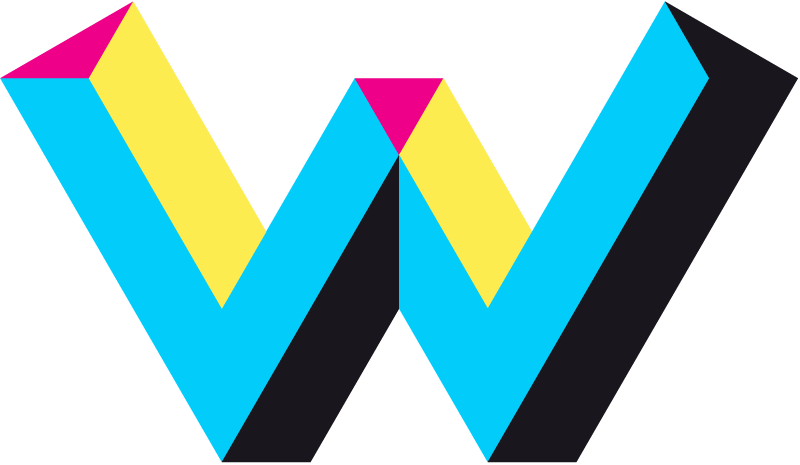
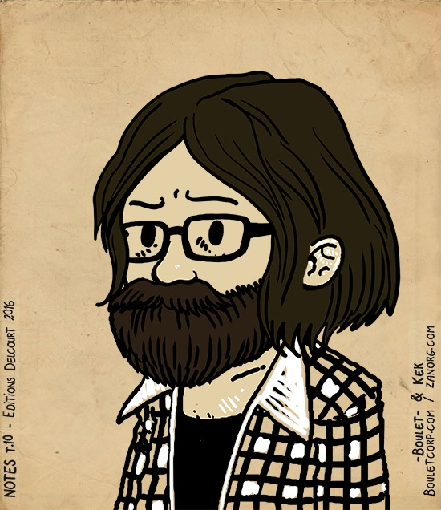

class: middle,center
# Docker
## Introduction to containers

.center[]

---
.logo[]

# Who am I?

 
.profile_title[Julien Garcia Gonzalez]

.profile_t[Devops facilitator]

.profile_t[[@jgsqware](https://twitter.com/jgsqware)]
.profile_t[[github.com/jgsqware](http://www.github.com/jgsqware)]

.profile[]

  
.center[]
---