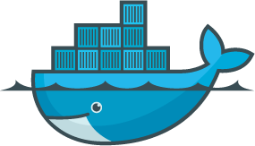
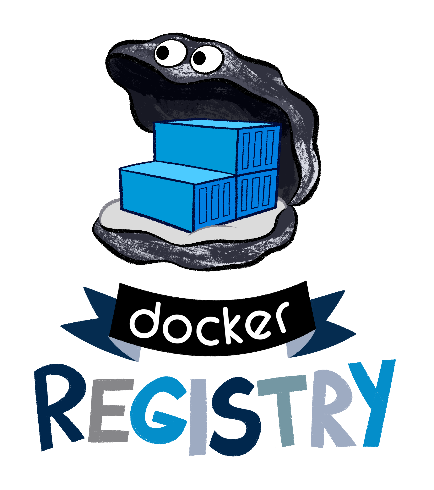

class: middle,center
# Docker
## Introduction to containers

.center[]

---
.logo[]

# Who am I?

</br>
.profile_title[Julien Garcia Gonzalez]

.profile_t[Devops facilitator]
.profile_t[[CoreOS Clair](https://github.com/coreos/clair)] maintainer


.profile_t[[@jgsqware](https://twitter.com/jgsqware)]
.profile_t[[github.com/jgsqware](http://www.github.com/jgsqware)]

.profile[]

</br></br>
.center[]
---
class: middle, center
.logo[]

# One step in the IT world

---
.logo[]
![:title_bar One step in the IT world - Dark ages]

.center[# One application on One physical server]

.center[]

---
.logo[]
![:title_bar One step in the IT world - Dark ages]

.center[# One application on One physical server]

- Huge cost
- Wasted resources
- Difficult to scale/migrate

.center[]

---
.logo[]
![:title_bar One step in the IT world - Lighter ages]

.center[# Hypervisor-based VMs]

.center[]

---
.logo[]
![:title_bar One step in the IT world - Lighter ages]

.center[# Hypervisor-based VMs - Pros]

- Multiple VMs on One host
- Better scaling
- Pay as you go model

.center[]

---
.logo[]
![:title_bar One step in the IT world - Lighter ages]

.center[# Hypervisor-based VMs - Cons]

- Dedicated CPU, Ram, Storage
- Entire OS => Wasted resources
- More VMs == More resources
- Application portability not guaranteed
.center[]

---
class: middle, center
.logo[]

# One step further

---
class: middle, center
.logo[]

# One step further
.big[The Deployment nightmare]

---
class: center
.logo[]
![:title_bar One step further - The Deployment nightmare]
</br>


---
.logo[]
![:title_bar One step further - The Deployment nightmare]

</br></br>


---
class: middle, center
.logo[]

# How to fix it?
.big[Back in time ...]

---
.logo[]
![:title_bar How to fix it? - Back in time ...]

</br>


---
.logo[]
![:title_bar How to fix it? - Back in time ...]

</br>


---
class: middle, center
.logo[]

# And Now? For IT?

---
class: middle, center
.logo[]


---
.logo[]
![:title_bar Docker]

</br></br>


---
.logo[]
![:title_bar Docker]

</br></br>


---
class: middle, center
.logo[]

# What is Docker ?

---
class: middle, center
.logo[]

# Containers vs VMs

---
.logo[]
![:title_bar Containers vs VMs]

</br>
.center[]

---
.logo[]
![:title_bar Containers vs VMs]

- Separation of concerns
    - Developers focus on building their apps
    - System admins focus on deployment
- Fast development cycle
- Application portability
- Build in one environment, ship to another
- Scalability
    - Easily spin up new containers if needed
- Run more apps on one host machine

---
class: middle, center
.logo[]

# How is it done?

---
.logo[]
![:title_bar How is it done?]

# From Kernel

Usage of **CGroup** + **Namespace**

- Resource management: CPU, Memory
- Isolation
- Security

---
.logo[]
![:title_bar How is it done?]

# From Filesystem

Containers are made from **Layers**

- Copy-on-write Filesystem
- Shared between containers
- Can be cached

.img-right[]
---
.logo[]
![:title_bar How is it done?]

# Networking

- **Private Network** between container
- **Overlay network** if multiple nodes

.center[]

---
.logo[]
![:title_bar How is it done?]

# Persistence

- Usage of volume
    - external Filesystem
- Shared between container
- Local or remote (AWS, NFS,...)

---
class: middle, center
.logo[]

# How can I build it?

---
.logo[]
![:title_bar How can I build it?]

# Dockerfile

```
FROM alpine
MAINTAINER Julien Garcia Gonzalez <jgonzalez@wemanity.com>

COPY ./hugo_0.14_linux_amd64 /bin/hugo
ENV HUGO_THEME hyde
RUN mkdir /hugo
WORKDIR "/hugo"
ENTRYPOINT exec hugo server -b http://"hugo-server" -p "59000" /hugo

EXPOSE 1313
```
---
.logo[]
![:title_bar How can I build it? Dockerfile]

# Dockerfile

```
FROM alpine
MAINTAINER Julien Garcia Gonzalez <jgonzalez@wemanity.com>

COPY ./hugo_0.14_linux_amd64 /bin/hugo
ENV HUGO_THEME hyde
RUN mkdir /hugo
WORKDIR "/hugo"
ENTRYPOINT exec hugo server -b http://"hugo-server" -p "59000" /hugo

EXPOSE 1313
```

- Each entry is a Layers
- Intermediate layers are cached to speed up the next build
- `FROM` <- Image coming from repository

---
class: middle, center
.logo[]

# Application = Front-End, Back-end, DB,...
.big[How to manage them?]

---
.logo[]
![:title_bar Applications. How to manage them?]
.img-right[]
# Docker-compose

```
version: "2"

services:
  vote:
    build: ./vote
    command: python app.py
    volumes:
     - ./vote:/app
    ports:
      - "5000:80"

  redis:
    image: redis:alpine
    ports: ["6379"]

  worker:
    build: ./worker

  db:
    image: postgres:9.4
```

---
class: middle, center
.logo[]

# How can I share my images?

---
class: center 
.logo[]
![:title_bar How can I share my images?]

# Docker Hub
# Docker Store
# Docker Registry  

---
.logo[]
![:title_bar How can I share my images? Docker Hub]

# Docker Hub

- Image Repositories
- Automated Builds
- Webhooks
- Organizations
- GitHub and Bitbucket Integration

---
.logo[]
![:title_bar How can I share my images? Docker Hub]


---
.logo[]
![:title_bar How can I share my images? Docker Store]

# Docker Store

- Same features as Docker Hub
- Trusted commercial and free software distributed as Docker Images.

---
.logo[]
![:title_bar How can I share my images? Docker Store]


---
.logo[]
![:title_bar How can I share my images? Docker Registry]

# Docker Registry

- Stateless
- Highly scalable
- On-Premise
- Your own distribution pipeline

.center[.note[**No GUI integrated**]]

.img-right-b[]

---
.logo[]
![:title_bar How can I share my images? Docker Registry]

Registry UI from Community:

### Commercial
- [Docker Trusted Registry](https://docs.docker.com/docker-trusted-registry/)

### Free
- [Portus](http://port.us.org/)
- [Hyper - Registry UI](https://github.com/mkuchin/docker-registry-web)
- [jgsqware - Registry UI](https://github.com/jgsqware/registry-ui)

---
class: middle, center
.logo[]

# Production environment
.big[How can I orchestrate it?]

---
.logo[]
![:title_bar Production environment, how can I orchestrate it?]

# Docker Swarm mode

- Cluster management integrated with Docker Engine
- Decentralized design image.
- Declarative service model
- Scaling
- Desired state reconciliation
- Multi-host networking
- Service discovery
- Load balancing
- Secure by default
- Rolling updates

---
.logo[]
![:title_bar Production environment, how can I orchestrate it? Docker Swarm mode]


---
class: middle, center
.logo[]

# Enterprise version?

---
.logo[]
![:title_bar Enterprise version?]

# Docker Datacenter

- Out of the box Container-As-A-Service
- Build Workflow
- Build, manage and deploy
- On-premise

.img-right[]

---
.logo[]
![:title_bar Enterprise version?]

 

---
.logo[]
![:title_bar Enterprise version?]

 


---
class: middle, center
.logo[]

# OK! But is it really used?

---
.logo[]
![:title_bar OK! But is it really used?]

# Customers

.center[]

---

.logo[]
![:title_bar OK! But is it really used?]

# Providers

.center[]

---
class: middle, center
.logo[]

# Demo

---
- Show docker commands (image, run, ps, rm, rmi)
- Show voting app Dockerfile
- Build voting app
- Show docker-compose for voting app
- Deploy voting app
- Make a change
- rebuild and redeploy

- Deploy swarm cluster
- Deploy voting app on it