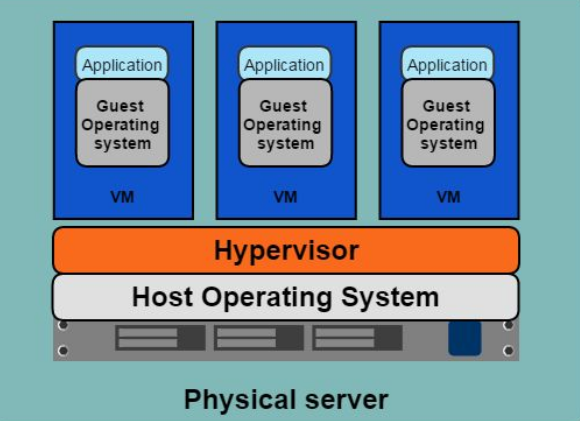
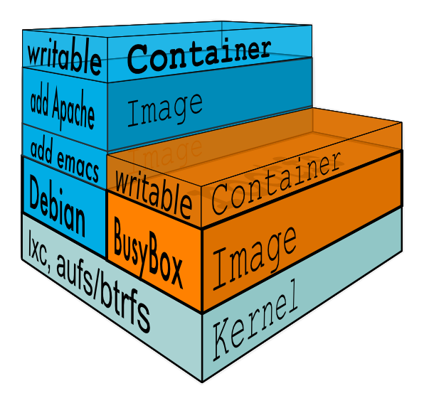

class: middle,center
# Docker
## Introduction to containers

.center[]

---
.logo[]

# Who am I?

</br>
.profile_title[Julien Garcia Gonzalez]

.profile_t[Devops facilitator]

.profile_t[[@jgsqware](https://twitter.com/jgsqware)]
.profile_t[[github.com/jgsqware](http://www.github.com/jgsqware)]

.profile[]

</br></br>
.center[]
---
class: middle, center
.logo[]

# One step in the IT world

---
.logo[]
![:title_bar One step in the IT world - Dark ages]

.center[# One application on One physical server]

.center[]

---
.logo[]
![:title_bar One step in the IT world - Dark ages]

.center[# One application on One physical server]

- Huge cost
- Wasted resources
- Difficult to scale/migrate

.center[]

---
.logo[]
![:title_bar One step in the IT world - Lighter ages]

.center[# Hypervisor-based VMs]

.center[]

---
.logo[]
![:title_bar One step in the IT world - Lighter ages]

.center[# Hypervisor-based VMs - Pros]

- Multiple VMs on One host
- Better scaling
- Pay as you go model

.center[]

---
.logo[]
![:title_bar One step in the IT world - Lighter ages]

.center[# Hypervisor-based VMs - Cons]

- Dedicated CPU, Ram, Storage
- Entire OS => Wasted resources
- More VMs == More resources
- Application portability note guaranteed
.center[]

---
class: middle, center
.logo[]

# One step further

---
class: middle, center
.logo[]

# One step further
.big[The Deployment nightmare]

---
class: center
.logo[]
![:title_bar One step further - The Deployment nightmare]
</br>


---
.logo[]
![:title_bar One step further - The Deployment nightmare]

</br></br>


---
class: middle, center
.logo[]

# How to fix it?
.big[Back in time ...]

---
.logo[]
![:title_bar How to fix it? - Back in time ...]

</br></br>


---
.logo[]
![:title_bar How to fix it? - Back in time ...]

</br></br>


---
class: middle, center
.logo[]

# And Now? For IT?

---
class: middle, center
.logo[]

# Docker 

---
.logo[]
![:title_bar Docker]

</br></br>


---
.logo[]
![:title_bar Docker]

</br></br>


---
class: middle, center
.logo[]

# What is Docker ?

---
class: middle, center
.logo[]

# Containers vs VMs

---
.logo[]
![:title_bar Containers vs VMs]

</br></br>


---
.logo[]
![:title_bar Containers vs VMs]

- Separation of concerns
    - Developers focus on building their apps
    - System admins focus on deployment
- Fast development cycle
- Application portability
- Build in one environment, ship to another
- Scalability
    - Easily spin up new containers if needed
- Run more apps on one host machine

---
class: middle, center
.logo[]

# How is it done?

---
.logo[]
![:title_bar How is it done?]

# From Kernel

Usage of **CGroup** + **Namespace**

- Resource management: CPU, Memory
- Isolation
- Security

---
.logo[]
![:title_bar How is it done?]

# From Filesystem

Containers are made from **Layers**

    - Copy-on-write Filesystem
    - Shared between containers
    - Can be cached



---
.logo[]
![:title_bar How is it done?]

# Networking

- **Private Network** between container
- **Overlay network** if multiple nodes

---
.logo[]
![:title_bar How is it done?]

# Persistence

- Usage of volume
    - external Filesystem
- Shared between container
- Local or remote (AWS, NFS,...)

---
class: middle, center
.logo[]

# How can I build it?

---
.logo[]
![:title_bar How can I build it?]

Dockerfile

```
FROM open-jdk:8

```
- Example
- Each entry is a Layers
- Caching System
- FROM -> show docker hub

---

Front-End, Back-end, DB? How to manage them?

---

Docker-compose

- Example
- v2
    - services
    - volumes
    - networks

---

How can I share my images?

---

Docker Hub & Docker Registry

---

Production environment, how can I orchestrate it?

---

Docker Swarm

- Cluster of docker nodes
- orchestration
- scheduler
- swarm-cluster image

---

---

Is it ready for Production?

---

- Company using it
- Provider
- Security matrix

Demo

- Show docker commands (image, run, ps, rm, rmi)
- Show voting app Dockerfile
- Build voting app
- Show docker-compose for voting app
- Deploy voting app
- Make a change
- rebuild and redeploy

- Deploy swarm cluster
- Deploy voting app on it